# Proyecto de Gestión de Gastos en Laravel

**Por Daniel Cuevas**

## Requisitos Mínimos Específicos de Laravel

### Modelos, Rutas y Controladores

- Define los modelos que un usuario pueda listar, agregar, editar y eliminar gastos.
- Define rutas para listar, agregar, editar y eliminar gastos.
- Implementa controladores correspondientes para manejar las acciones de cada ruta.

### Migraciones

- Crea migraciones para configurar la estructura de la base de datos SQLite.

## Requisitos Opcionales Específicos de Laravel (Para Optar a Más Nota)

- **Validación de Datos**: Implementa validaciones para asegurarte de que los campos requeridos se completen al agregar o editar un gasto.
- **Autenticación de Usuarios**: Implementa autenticación de usuarios para que cada usuario pueda gestionar sus propios gastos.

## Instrucciones para Ejecutar el Proyecto

### Antes de Proceder a la Instalación

Asegúrate de tener instalados:

- Composer
- Laravel
- SQLite
- Node.js
- NPM

### Pasos para la Instalación

1. **Clonar el Repositorio**

    ```sh
    git clone https://github.com/dcuevas-dawi/app-gestion-gastos.git
   (Si más adelante da problema de permisos, ejecutar en una consola con Administrador/sudo)
    ```

2. **Instalar las Dependencias**

    ```sh
    cd app-gestion-gastos
    composer install
    npm install (Puede tardar un poco)
    npm run build
    ```

3. **Crear el Archivo de Entorno**

    ```sh
    cp .env.example .env
    ```

4. **Generar la Clave de la Aplicación**

    ```sh
    php artisan key:generate
    ```

5. **Migrar la Base de Datos**

    ```sh
    php artisan migrate
    ```

   > **Nota**: Quizás de una advertencia de que no se ha encontrado la base de datos, pero nos preguntará si deseamos crearla, así que seleccionamos 'yes'.

6. **Iniciar el Servidor Interno de PHP y el Gestor de Paquetes NPM**

    ```sh
    composer run dev
    ```

   > Esto ejecuta por detrás el comando `php artisan serve` y `npm run dev`.

---

## Historias de usuario

Una vez que hemos configurado el entorno y ejecutado `composer run dev`, nos aparecerá el mensaje de que la aplicación se está sirviendo en `localhost:8000`.

Haz clic en la URL de la línea que dice: `INFO  Server running on [http://127.0.0.1:8000]`.

Se abrirá la aplicación en nuestro navegador por defecto y nos redirigirá a `http://127.0.0.1:8000/login`, donde veremos:

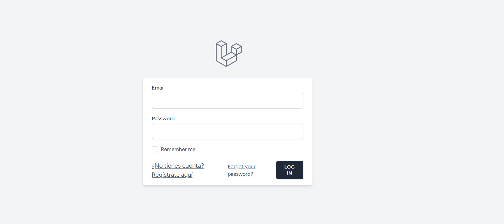

Haz clic en `¿No tienes cuenta? Regístrate aquí` para registrarte.

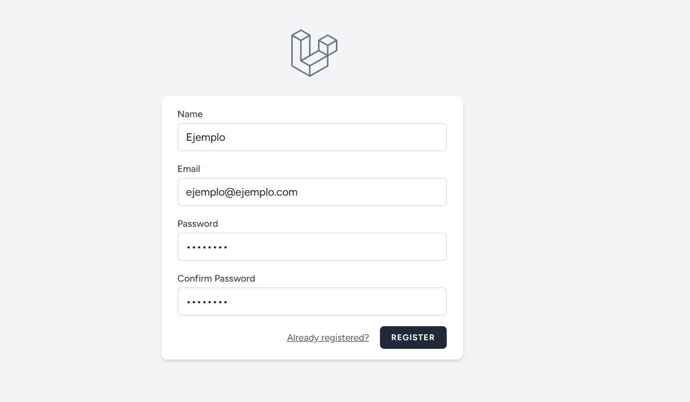

Veremos un mensaje de registro satisfactorio y seremos redirigidos a la página del dashboard ya logueados. Haz clic en `Ir a la App`.

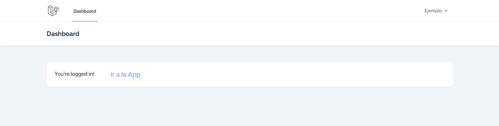

Aquí veremos la vista general de la aplicación, donde irán apareciendo los gastos.

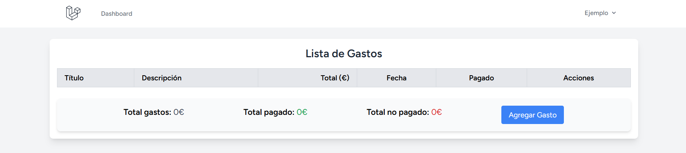

Si haces clic en el botón azul `Agregar gasto`, nos llevará a un formulario donde podremos añadir un gasto.

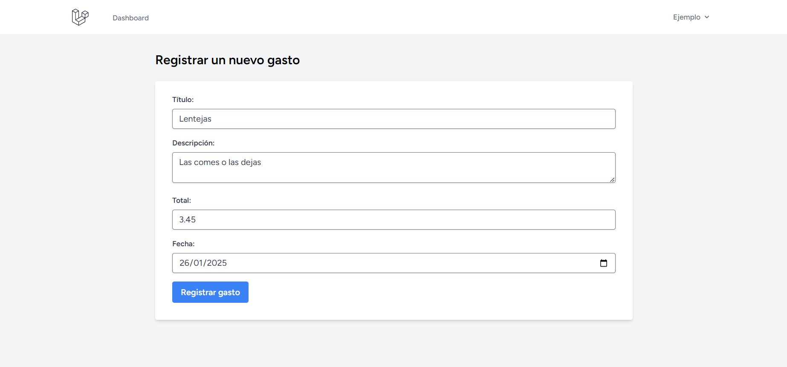

Al rellenar los campos y darle a `Agregar`, nos llevará de nuevo a la vista general donde veremos el primer gasto añadido.

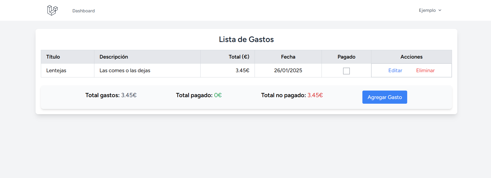

Ahora podremos marcarlo como pagado o no, según el caso.

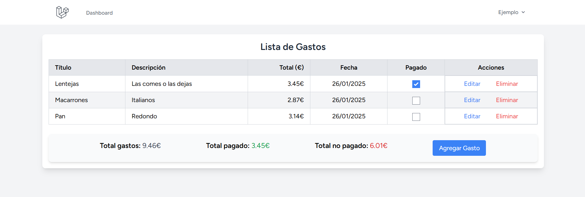

Si nos hemos equivocado registrando algún gasto, lo podemos modificar haciendo clic en el botón `Editar`.

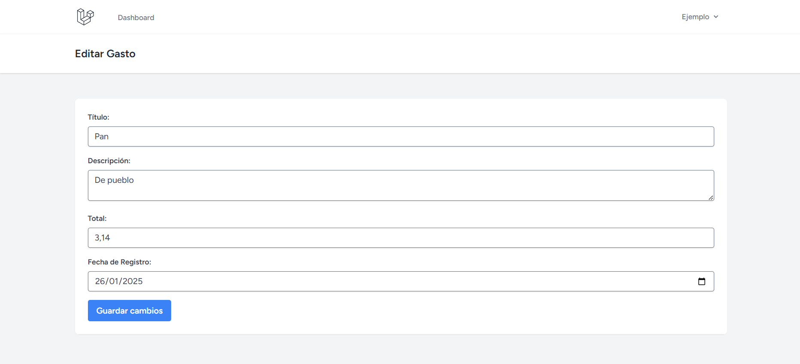

Por último, tenemos la opción de eliminar el gasto dando al botón `Eliminar`, donde nos pedirá confirmar la eliminación.

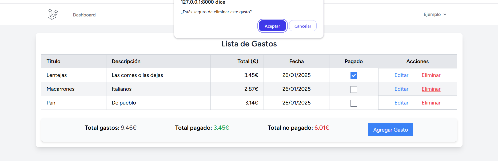

Se recargará la página con el gasto eliminado y los totales actualizados.

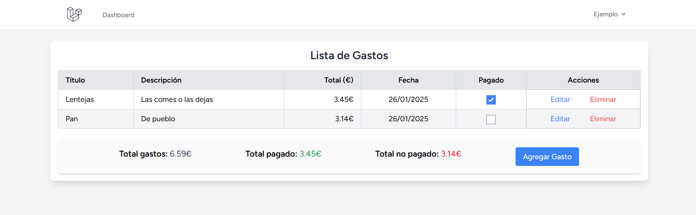

Por último, podemos cerrar sesión haciendo clic en el desplegable de la esquina superior derecha e iniciar sesión con otro usuario para asegurarnos de que cada gasto va asociado a su usuario y no se mezclan.

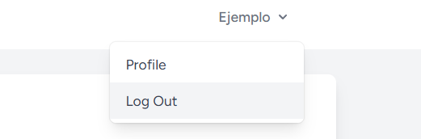

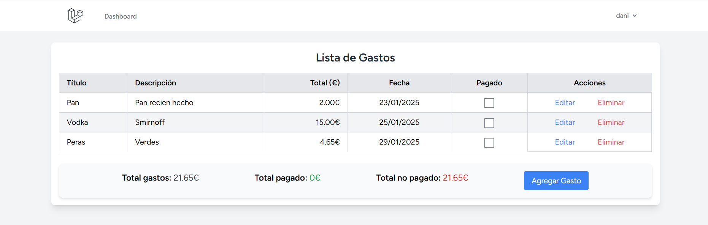
